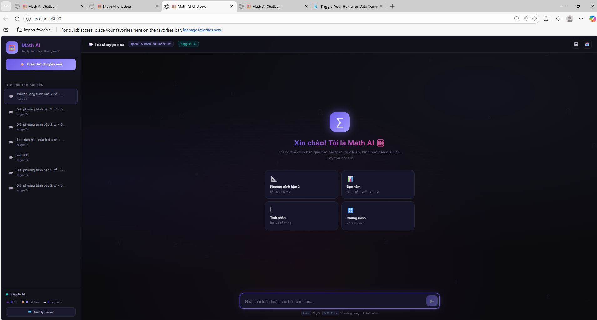

# 🧮 Math AI Chatbox

> Ứng dụng chatbot toán học với giao diện đẹp, hỗ trợ render LaTeX, sử dụng AI model chạy trên Kaggle và phục vụ qua ngrok. Hỗ trợ 16 người dùng đồng thời với batch processing.

---

## 📸 Giao diện




### Trò chuyện với AI — Chat Interface

---

## ⚡ Tính năng chính

| Tính năng                      | Mô tả                                    |
| ------------------------------ | ---------------------------------------- |
| 🖥️ **Backend Node.js riêng**   | Proxy, lưu trữ, quản lý server tách biệt |
| 🔄 **Quản lý nhiều server**    | Lưu/chuyển đổi URL ngrok dễ dàng         |
| 💾 **Lưu lịch sử vĩnh viễn**   | Database JSON trên máy local             |
| 👥 **16 người dùng đồng thời** | Batch processing trên GPU                |
| 📐 **Render toán học**         | KaTeX (LaTeX) + Markdown                 |
| 🌙 **Dark theme**              | Giao diện tối, animation mượt            |
| 📱 **Responsive**              | Hỗ trợ desktop & mobile                  |
| 📊 **Thống kê realtime**       | Số user, batches, requests               |
| 📤 **Xuất chat**               | Export cuộc trò chuyện ra Markdown       |
| 🔁 **Auto-reconnect**          | Tự kết nối server mặc định               |

---

## 🏗️ Kiến trúc hệ thống

```
┌─────────────┐    ┌──────────────────┐    ┌─────────────────────┐
│  Trình duyệt │───▶│  Backend Node.js  │───▶│  Kaggle + Ngrok     │
│  (Frontend)  │◀───│  localhost:3000   │◀───│  (AI Model Server)  │
└─────────────┘    └──────────────────┘    └─────────────────────┘
                         │
                    ┌────┴────┐
                    │ data/   │
                    │ .json   │  ← Lưu servers, lịch sử chat
                    └─────────┘
```

## 📁 Cấu trúc dự án

```
Chatbox Model/
├── server.js              # Backend Node.js (chạy trên máy)
├── package.json           # Dependencies
├── public/
│   └── index.html         # Giao diện web chatbox
├── data/
│   └── database.json      # Database (servers, conversations, messages)
├── screenshots/           # Ảnh giao diện cho README
│   ├── welcome.png
│   ├── chat.png
│   ├── math-render.png
│   ├── server-manager.png
│   └── mobile.png
├── kaggle_server.ipynb    # Notebook AI server (chạy trên Kaggle)
└── README.md
```

---

## 🚀 Hướng dẫn sử dụng

### Bước 1: Thiết lập AI Server trên Kaggle

1. **Đăng ký ngrok**: Truy cập [ngrok.com](https://ngrok.com), đăng ký miễn phí
2. **Lấy Auth Token**: Dashboard → Your Authtoken → Copy
3. **Upload notebook**: Upload `kaggle_server.ipynb` lên [Kaggle](https://www.kaggle.com)
4. **Cấu hình Kaggle**:
   - Bật **Internet** (Settings → Internet → On)
   - Bật **GPU T4 x2** hoặc **GPU P100** (Settings → Accelerator)
5. **Chỉnh sửa Cell 2**:
   - Thay `NGROK_TOKEN = "YOUR_NGROK_TOKEN_HERE"` bằng token của bạn
   - Chọn model bằng `MODEL_INDEX` (0-3)
6. **Chạy tất cả cells** theo thứ tự
7. **Copy URL ngrok** hiển thị ở Cell cuối

### Bước 2: Chạy Backend trên máy tính

```bash
cd "Chatbox Model"
npm install          # Chỉ cần chạy lần đầu
npm start            # Khởi động backend
```

Server chạy tại `http://localhost:3000`

### Bước 3: Kết nối Server

1. Mở `http://localhost:3000` trên trình duyệt
2. Nhấn **"🖥️ Quản lý Server"** ở sidebar
3. Nhập tên, URL ngrok, model → **"💾 Lưu Server"**
4. Nhấn **"⚡ Kết nối"** → Khi hiện ✅ → Bắt đầu chat!

> 💡 **Lưu nhiều server**: Bạn có thể lưu nhiều URL ngrok khác nhau và chuyển đổi nhanh giữa chúng.

---

## 📋 Danh sách Model hỗ trợ

| #   | Model                                   | Size | Mô tả                       |
| --- | --------------------------------------- | ---- | --------------------------- |
| 0   | `Qwen/Qwen2.5-Math-1.5B-Instruct`       | 1.5B | Nhẹ, nhanh, phù hợp GPU yếu |
| 1   | `Qwen/Qwen2.5-Math-7B-Instruct`         | 7B   | Tốt hơn, cần GPU mạnh       |
| 2   | `microsoft/Phi-3-mini-4k-instruct`      | 3.8B | Đa năng, không chỉ toán     |
| 3   | `deepseek-ai/deepseek-math-7b-instruct` | 7B   | Chuyên toán, rất tốt        |

---

## 🔧 Batch Processing — Cách hoạt động

```
[User 1] ──┐
[User 2] ──┤
   ...      ├──→ [Request Queue] ──→ [Batch Worker] ──→ [Model GPU]
[User 15]──┤                          (gom tối đa 16)
[User 16]──┘
```

1. Người dùng gửi câu hỏi → Backend proxy → Kaggle `/api/chat`
2. Kaggle server đưa request vào **Request Queue**
3. **Batch Worker** gom tối đa 16 requests trong 0.5 giây
4. Chạy **batch inference** trên GPU (xử lý song song)
5. Trả kết quả về cho từng user

---

## ⚠️ Lưu ý

- Kaggle notebook có thời gian chạy giới hạn (**12 giờ** cho GPU)
- URL ngrok **thay đổi** mỗi lần khởi động lại notebook
- Model 7B cần GPU **T4 hoặc P100** trở lên
- Model 1.5B có thể chạy trên CPU nhưng chậm
- Ngrok free giới hạn bandwidth — nên dùng cho testing

---

## 📄 License

MIT
